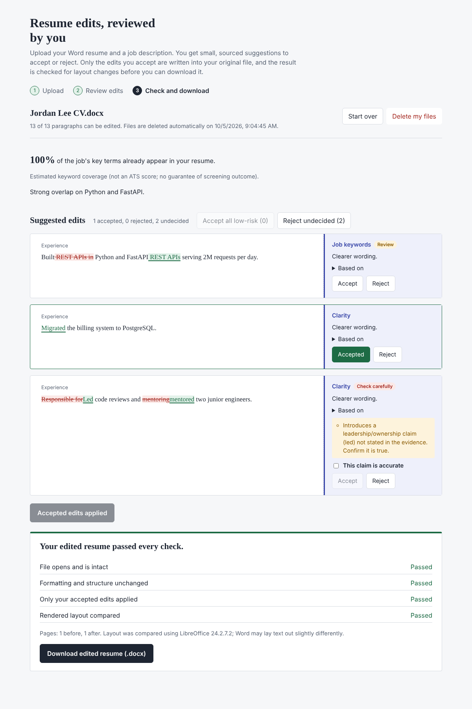
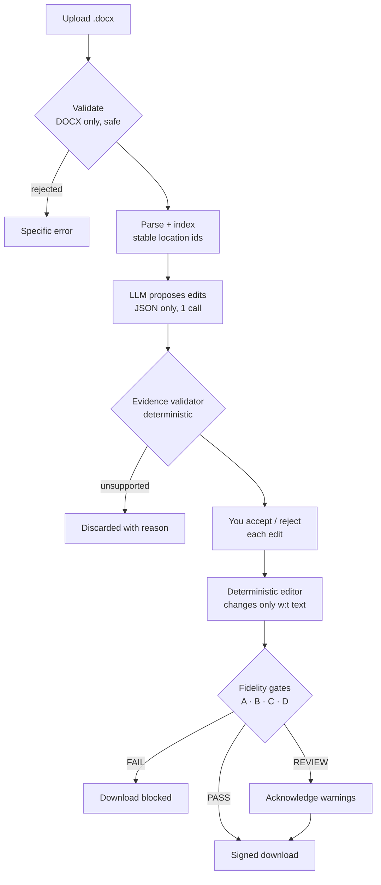

<div align="center">

# Resume Edit Agent

**Tailor your Word resume to a job without losing a single formatting detail.**
The AI suggests small, evidence-backed edits. You approve each one. Only those
edits are written into *your* original `.docx`, then verified before you download.


-000000)

[Quickstart](#quickstart) · [How it works](#how-it-works) · [Verification](#how-we-know-the-layout-survived) ·
[Development](#development) · [Architecture](docs/ARCHITECTURE.md) · [API](docs/API.md) · [Evaluation](docs/FIDELITY_EVALUATION.md)

</div>

<p align="center">
  
</p>

## Why this exists

Most AI resume tools regenerate your resume as new text, which throws away your
template, invents achievements and leaves you to spot what changed. This project
takes the opposite approach:

| | Typical AI rewrite | This project |
|---|---|---|
| Output | A new document | **Your uploaded `.docx`**, minimally edited |
| Formatting | Rebuilt or lost | Runs, styles, tables, headers, images and page setup preserved byte-for-byte outside edited text |
| Control | Accept the whole rewrite | **Accept or reject each edit**; nothing is applied without approval |
| Facts | Model may embellish | Every edit must quote resume evidence; unsupported numbers, tools, certifications and job keywords are **rejected by code** |
| Trust | "Looks fine" | Output is re-parsed, diffed and **rendered side by side**; failures block the download |
| Privacy | Cloud API | Runs on a **local model** (Ollama) by default; files are auto-deleted |

## Quickstart

**Prerequisites:** Python 3.11+, [uv](https://docs.astral.sh/uv/), Node.js 18+,
[Ollama](https://ollama.com), and LibreOffice + poppler for the layout check
(`brew install --cask libreoffice && brew install poppler`, or
`apt install libreoffice-writer-nogui poppler-utils`).

```bash
git clone https://github.com/joyrana/LangGraph-Resume-Agent.git && cd LangGraph-Resume-Agent
cp env.example .env
uv sync --extra dev                  # creates .venv; run `uv lock` first if uv.lock is missing
ollama pull gpt-oss                  # any chat model works; set OLLAMA_MODEL in .env
(cd frontend && npm ci || npm install)
./dev.sh                             # API → http://127.0.0.1:8000  ·  UI → http://localhost:5173
```

Open the UI, upload a `.docx`, paste a job description and review the
suggestions. Interactive API docs are at `http://127.0.0.1:8000/docs`.

<details>
<summary><b>Run with Docker</b></summary>

```bash
docker compose up --build                     # uses the model at $OLLAMA_BASE_URL
docker compose --profile ollama up --build    # also starts an Ollama container
docker compose exec ollama ollama pull gpt-oss
```

The image is Ubuntu 24.04-based (LibreOffice 24.2, the version the layout
thresholds were calibrated on), runs as a non-root user, has a health check,
and keeps data in the `resume-data` volume. Serve the frontend separately
(`npm run build` → any static host) and set `FRONTEND_ORIGIN`.
</details>

## How it works



**The model suggests; code decides.** The model never sees document XML and
cannot call tools. It returns a JSON list of `{location_id, original_text,
proposed_text, reason, supporting_evidence}`. Everything after that is
deterministic:

1. **Evidence validation.** The quote must occur exactly once at an editable
   location, and the cited evidence must appear verbatim in the resume.
   Numbers, technologies, certifications and job-description keywords must be
   traceable to the resume or to facts you supplied, and changing a stated
   number is rejected. Turning a duty into an achievement ("worked on" → "led")
   is allowed only after you tick *This claim is accurate*. Links, e-mail
   addresses, line breaks and oversized rewrites are rejected.
2. **Review.** Every decision is persisted with an audit trail. Concurrent
   tabs can't overwrite each other: each change requires the current
   `review_revision`.
3. **Editing.** Only the `w:t` text of the targeted runs changes. A token-level
   diff keeps unchanged words in their original runs (bold stays bold, links
   stay links). It is all-or-nothing, never touches the original upload, and
   copies every other package part unchanged.
4. **Finalization** is idempotent for the exact set of accepted edits and never
   calls the model. A failed check cannot be bypassed by retrying.

## How we know the layout survived

| Gate | Checks | On failure |
|---|---|---|
| **A · Integrity** | Output passes the upload validator, reopens in python-docx, CRCs valid, no parts lost, no new external links | Block |
| **B · Structure** | Untouched parts byte-identical; edited XML identical once edited text is blanked; sections, margins, columns, styles, lists, tables, images, links and run formats unchanged | Block |
| **C · Content** | Every paragraph equals the original plus *exactly* the accepted edits; rejected edits absent; no duplicates; no untraceable numbers | Block |
| **D · Visual** | Original and output rendered with LibreOffice. Edited regions are located precisely with colour-marked renders, then word positions, fonts, colours, line wraps, page flow, images, borders and pixels outside those regions are compared | Review (blank page or missing image: block) |

**Measured** with `python -m app.evaluation.fidelity_eval` on a 10-fixture
corpus (tables, nested tables, columns, sections, headers and footers, fields,
hyperlinks, images, tracked changes, text boxes, multi-page) using LibreOffice
24.2.7.2:

- **139 / 139** injected regressions were blocked end to end (font, colour,
  spacing, margins, page breaks, removed or swapped images, table widths,
  duplicated paragraphs, highlights, shading, corrupt packages, external
  templates…).
- **15 / 15** legitimate edits received the expected decision, including a
  long edit that pushes content onto the next page and correctly asks for
  review.
- The visual gate *alone* flags 110 / 110 visually detectable regressions with
  0 / 14 false alarms at the calibrated threshold.

These numbers come from a small synthetic corpus and LibreOffice is a proxy for
Word. See [the evaluation report](docs/FIDELITY_EVALUATION.md) for methodology,
the calibration history and limitations before relying on them.

## Project structure

```text
app/
├── api/           FastAPI routes, schemas, error envelope, middleware
├── core/          config (validated env), errors, JSON logging, tokens
├── document/      upload validation · OOXML parser · editor · fidelity gates
├── resume/        prompts · proposal schemas · evidence validator · edit policy
├── llm/           provider protocol (Ollama, disabled, scripted for tests)
├── workflow/      LangGraph graphs, typed state, nodes, routing
├── persistence/   SQLite repository + integrity-checked artifact store
├── services/      ResumeService — every use case, framework-free
└── evaluation/    fixture corpus, regression injectors, calibration, proposal eval
frontend/          React + TypeScript review UI (Vite)
tests/             unit · integration · security · evaluation
evaluation/        labelled datasets and machine-readable reports
docs/              architecture, API, fidelity evaluation, audit
```

## Configuration

Settings are environment variables (or `.env`), validated at startup. An
invalid value stops the server with a message naming the variable. Full list:
[`env.example`](env.example).

| Variable | Default | Purpose |
|---|---|---|
| `OLLAMA_BASE_URL` · `OLLAMA_MODEL` | `http://localhost:11434` · `gpt-oss:latest` | Model endpoint (resume text is sent here) |
| `RESUME_LLM_TEMPERATURE` · `…_TIMEOUT_SECONDS` · `…_MAX_RETRIES` | `0.1` · `180` · `2` | Low-variance structured output with bounded retries |
| `RESUME_DEPLOYMENT_MODE` | `local` | `shared` requires `RESUME_API_AUTH_TOKEN` + `RESUME_SIGNING_SECRET` and hides `/docs` |
| `RESUME_SESSION_TTL_HOURS` | `24` | Automatic deletion of uploads, outputs and renders |
| `RESUME_MAX_UPLOAD_BYTES` | 5 MB | Also limits uncompressed size, part count and compression ratio |
| `RESUME_RENDERER_EXPECTED_VERSION` | unset (`24.2` in Docker) | A different renderer version downgrades PASS to review |
| `RESUME_VISUAL_GATE_REQUIRED` | `false` | Block delivery when layout can't be verified |

## Development

```bash
uv sync --extra dev                                   # Python deps incl. pytest, ruff, mypy
uv run pytest                                         # all suites (~1 min with LibreOffice)
uv run pytest -m "not renderer"                       # skip LibreOffice-dependent tests
uv run ruff check . && uv run ruff format --check .   # lint + format
uv run mypy app                                       # type check
(cd frontend && npx tsc --noEmit)                     # frontend type check
```

| Suite | Covers |
|---|---|
| `tests/unit` | parser, locations, editor, evidence validator, proposer, fidelity gates, config, logging |
| `tests/integration` | full workflow through the service (scripted model, real renderer); HTTP contract tests |
| `tests/security` | spoofed types, zip bombs, XXE, traversal, macros, encryption, external templates, prompt injection |
| `tests/evaluation` | corpus determinism and labelled-dataset regression guards |

Tests use a **scripted model**, so they are deterministic, offline and free.
Evaluate a real model with:

```bash
uv run python -m app.evaluation.proposal_eval --live   # schema validity, grounding rate, latency, tokens
uv run python -m app.evaluation.fidelity_eval          # recalibrate the gates (~30 min)
```

**Conventions:** typed Python (Pydantic models at every boundary); a small,
framework-free service layer; graph state holds ids, never documents; every
prompt change bumps `PROMPT_VERSION`; every bug fix adds a regression test or a
labelled dataset case.

## API at a glance

`POST /api/sessions` (multipart upload) → poll `GET /api/sessions/{id}` →
`POST /api/sessions/{id}/decisions` → `POST /api/sessions/{id}/finalize` →
`POST …/finalizations/{fid}/download-link` → `GET /api/downloads/{token}`.

Every session call sends `X-Session-Token`. Errors share one envelope:
`{"error": {"code", "message", "details", "correlation_id"}}`. Full reference
and breaking changes from 0.2: [docs/API.md](docs/API.md).

## Security & privacy

- **Untrusted input by default.** Uploads are size-, ratio- and
  structure-checked and parsed with entity resolution off. Macros, encrypted
  files and external templates are rejected, and nothing in a document is
  executed.
- **Prompt-injection resistant by construction.** Resume and job text are
  delimited data, the model has no tools, and every output is re-validated.
  Instructions hidden in a resume can't add links, claims or keywords.
- **Isolation.** Per-session 256-bit capability tokens (stored hashed);
  HMAC-signed downloads that expire after 5 minutes; artifacts addressed by
  server-generated ids; a wrong token is indistinguishable from a missing
  session.
- **Data minimisation.** Logs are JSON with resume content redacted. Files are
  purged after the TTL or immediately via *Delete my files*. The server warns
  at startup if the model endpoint is not local.

Details and threat model: [docs/ARCHITECTURE.md](docs/ARCHITECTURE.md#security-model).

## Limitations

- **Read-only content.** Text boxes, field results, tracked changes, content
  controls, equations, footnotes and comments are preserved but not editable.
  Edits can't cross links, images, tabs or line breaks.
- **LibreOffice approximates Word.** Word may wrap lines slightly differently;
  the UI says so.
- **Small calibration corpus.** It is synthetic and does not yet include real
  Word-authored templates, so treat the evaluation numbers as a starting point.
- **Single-host deployment.** SQLite is used for storage, and sessions are
  isolated by token rather than user accounts (no SSO).
- **Conservative validator.** New word forms or abbreviations not in the
  resume (e.g. "Dockerized", "CKA") are rejected.

## Troubleshooting

| Symptom | Fix |
|---|---|
| "The language model service could not be reached" | `ollama serve`; check `OLLAMA_BASE_URL`; then **Try analysis again** |
| "Model service rejected the request" | Pull the model: `ollama pull <OLLAMA_MODEL>` |
| "Rendered layout compared: Not run" | Install LibreOffice + poppler or set `RESUME_SOFFICE_PATH`; check `GET /ready` |
| "Renderer version … differs from pinned" | Use LibreOffice 24.2, or recalibrate and update `RESUME_RENDERER_EXPECTED_VERSION` |
| Upload rejected: "links to external content" | Embed the linked template or image in Word and save again |
| "No editable text was found" | The text lives in text boxes; move it into normal paragraphs |
| No suggestions | Nothing could be backed by evidence; add true facts under *Facts you can confirm* |

## Contributing

1. Branch from `main` (`feat/…`, `fix/…`).
2. Keep changes small and covered by tests. Document-handling changes should
   add a corpus fixture or regression injector. Validator changes should add
   cases to `evaluation/datasets/proposals_v1.json`.
3. Before opening a PR, run `pytest`, `ruff check`, `ruff format --check`,
   `mypy app` and `npx tsc --noEmit`.
4. Explain user-visible and API changes in the PR description and update
   `docs/`.

This repository does not yet include a license file. Add one before accepting
outside contributions.
